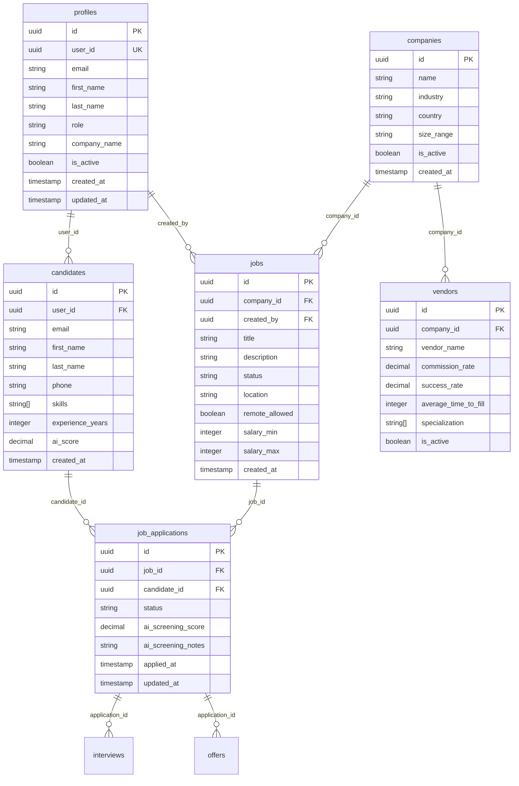
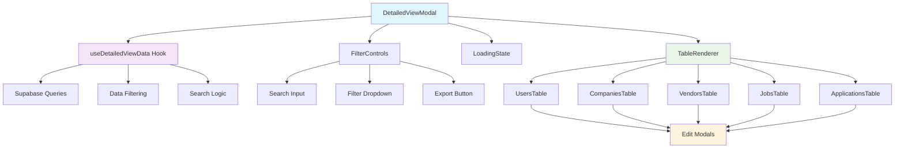

# DetailedViewModal Technical Documentation

## Table of Contents
1. [Architecture Overview](#architecture-overview)
2. [File Structure](#file-structure)
3. [Type Definitions](#type-definitions)
4. [Configuration Constants](#configuration-constants)
5. [Utility Functions](#utility-functions)
6. [Data Management Hook](#data-management-hook)
7. [Table Components](#table-components)
8. [Reusable UI Components](#reusable-ui-components)
9. [Main Component](#main-component)
10. [Database Schema](#database-schema)
11. [Component Relationships](#component-relationships)
12. [Development Guidelines](#development-guidelines)
13. [Production Deployment](#production-deployment)
14. [Troubleshooting](#troubleshooting)

---

## Architecture Overview

The DetailedViewModal has been refactored from a monolithic 600+ line component into a modular, maintainable architecture following React best practices:

### Design Principles
- **Separation of Concerns**: Each file has a single responsibility
- **Type Safety**: Full TypeScript coverage with strict typing
- **Reusability**: Components can be easily extended or modified
- **Performance**: Optimized data fetching and filtering
- **Maintainability**: Clear structure for easy debugging and updates

### Technology Stack
- **React 18** with functional components and hooks
- **TypeScript** for type safety
- **Supabase** for database operations
- **Tailwind CSS** for styling
- **Shadcn/ui** for UI components

---

## File Structure

```
src/components/modals/DetailedViewModal/
├── index.tsx                           # Main orchestrating component
├── types.ts                           # TypeScript type definitions
├── constants.ts                       # Configuration constants
├── utils.ts                          # Helper functions
├── hooks/
│   └── useDetailedViewData.ts        # Data management hook
├── tables/
│   ├── UsersTable.tsx               # User data table
│   ├── CompaniesTable.tsx           # Company data table
│   ├── VendorsTable.tsx             # Vendor data table
│   ├── JobsTable.tsx                # Jobs data table
│   └── ApplicationsTable.tsx        # Applications data table
└── components/
    ├── TableRenderer.tsx            # Table routing component
    ├── FilterControls.tsx           # Search and filter UI
    └── LoadingState.tsx             # Loading and empty states
```

---

## Type Definitions

### Core Types (`types.ts`)

```typescript
// Main data types supported by the modal
export type DataType = 'users' | 'companies' | 'vendors' | 'jobs' | 'applications' | 'activeJobs' | 'monthlyHires';

// Main modal props
export interface DetailedViewModalProps {
  type: DataType;                    // Determines data source and table type
  open: boolean;                     // Modal visibility state
  onOpenChange: (open: boolean) => void;  // Modal close handler
  title: string;                     // Modal title
}

// Edit modal state management
export interface EditModalState {
  open: boolean;                     // Edit modal visibility
  id: string | null;                 // ID of item being edited
}

// Filter dropdown options
export interface FilterOption {
  value: string;                     // Filter value
  label: string;                     // Display label
}

// Base props for all table components
export interface TableBaseProps {
  data: any[];                       // Table data array
  onEdit?: (id: string, type: string) => void;  // Edit action handler
}
```

### Database Entity Types
The component works with these Supabase database entities:
- **Profiles**: User account information
- **Companies**: Company/client information
- **Vendors**: Vendor/recruiter information
- **Jobs**: Job postings
- **Job Applications**: Application submissions
- **Candidates**: Candidate profiles

---

## Configuration Constants

### Filter Options (`constants.ts`)

```typescript
export const FILTER_OPTIONS: Record<DataType, FilterOption[]> = {
  users: [
    { value: 'all', label: 'All Roles' },
    { value: 'candidate', label: 'Candidates' },
    { value: 'client', label: 'Clients' },
    { value: 'vendor', label: 'Vendors' },
    { value: 'super_admin', label: 'Super Admins' }
  ],
  // ... other filter configurations
};
```

### Status Color Mapping
```typescript
export const STATUS_COLORS: Record<string, string> = {
  published: 'bg-green-100 text-green-800',    // Active/positive states
  active: 'bg-green-100 text-green-800',
  hired: 'bg-green-100 text-green-800',
  draft: 'bg-yellow-100 text-yellow-800',      // Pending states
  screening: 'bg-yellow-100 text-yellow-800',
  interview: 'bg-blue-100 text-blue-800',      // In-progress states
  offer: 'bg-blue-100 text-blue-800',
  closed: 'bg-red-100 text-red-800',           // Negative states
  rejected: 'bg-red-100 text-red-800',
  default: 'bg-gray-100 text-gray-800'         // Fallback
};
```

---

## Utility Functions

### Search and Filter Utilities (`utils.ts`)

```typescript
// Extracts searchable fields based on data type
export const getSearchFields = (item: any, type: DataType): string[]

// Returns appropriate CSS classes for status badges
export const getStatusColor = (status: string): string

// Applies status-based filtering logic
export const applyStatusFilter = (item: any, type: DataType, filterValue: string): boolean

// Formats date strings for display
export const formatDate = (dateString: string): string

// Returns AI score styling based on score value
export const getAIScoreVariant = (score: number): string
```

### Usage Examples
```typescript
// Search functionality
const searchFields = getSearchFields(user, 'users');
const matchesSearch = searchFields.some(field => 
  field?.toString().toLowerCase().includes(searchTerm.toLowerCase())
);

// Status styling
const statusClass = getStatusColor('published'); // Returns green styling

// Date formatting
const formattedDate = formatDate('2024-01-15T10:30:00Z'); // Returns "1/15/2024"
```

---

## Data Management Hook

### useDetailedViewData Hook (`hooks/useDetailedViewData.ts`)

**Purpose**: Centralized data fetching, filtering, and state management

**Parameters**:
- `type: DataType` - Determines which data to fetch
- `open: boolean` - Triggers data fetch when modal opens

**Returns**:
```typescript
{
  data: any[];                    // Raw data from database
  filteredData: any[];           // Filtered and searched data
  loading: boolean;              // Loading state
  searchTerm: string;            // Current search term
  filterValue: string;           // Current filter value
  setSearchTerm: (term: string) => void;
  setFilterValue: (value: string) => void;
  refetchData: () => Promise<void>;
}
```

### Data Fetching Strategy

```typescript
// Query building based on data type
const buildQuery = useCallback(() => {
  switch (type) {
    case 'users':
      return supabase
        .from('profiles')
        .select('*, created_at')
        .order('created_at', { ascending: false });
    
    case 'applications':
      return supabase
        .from('job_applications')
        .select(`
          *,
          jobs (title, companies (name)),
          candidates (first_name, last_name, email)
        `)
        .order('applied_at', { ascending: false });
    // ... other cases
  }
}, [type]);
```

### Performance Optimizations
- **Memoized queries** prevent unnecessary rebuilds
- **Debounced filtering** for smooth search experience
- **Conditional fetching** only when modal is open
- **Error handling** with user-friendly messages

---

## Table Components

### Component Structure
Each table component follows the same pattern:

```typescript
interface TableProps extends TableBaseProps {
  // Additional specific props if needed
}

export const TableComponent = ({ data, onEdit }: TableProps) => {
  return (
    <Table>
      <TableHeader>
        {/* Column headers */}
      </TableHeader>
      <TableBody>
        {data.map((item) => (
          <TableRow key={item.id}>
            {/* Table cells with data */}
            <TableCell>
              {/* Action buttons */}
              <Button onClick={() => onEdit?.(item.id, 'entityType')}>
                <Edit className="w-4 h-4" />
              </Button>
            </TableCell>
          </TableRow>
        ))}
      </TableBody>
    </Table>
  );
};
```

### Individual Table Components

#### UsersTable.tsx
- **Data Source**: `profiles` table
- **Key Fields**: name, email, role, company, created date
- **Actions**: View, Edit user profile
- **Special Features**: Role badge display

#### CompaniesTable.tsx
- **Data Source**: `companies` table  
- **Key Fields**: company name, industry, size, country, status
- **Actions**: View, Edit company details
- **Special Features**: Active/inactive status styling

#### VendorsTable.tsx
- **Data Source**: `vendors` table with company joins
- **Key Fields**: company name, commission rate, success rate, specializations
- **Actions**: View, Edit vendor details
- **Special Features**: Specialization tags with overflow handling

#### JobsTable.tsx
- **Data Source**: `jobs` table with company and application joins
- **Key Fields**: job title, company, location, application count, status
- **Actions**: View, Edit job posting
- **Special Features**: Application count display

#### ApplicationsTable.tsx
- **Data Source**: `job_applications` table with multiple joins
- **Key Fields**: candidate name, job title, company, AI score, status
- **Actions**: View, Edit application
- **Special Features**: AI score color coding, candidate email display

---

## Reusable UI Components

### TableRenderer.tsx
**Purpose**: Routes to appropriate table component based on data type

```typescript
export const TableRenderer = ({ type, data, onEdit }: TableRendererProps) => {
  switch (type) {
    case 'users': return <UsersTable data={data} onEdit={onEdit} />;
    case 'companies': return <CompaniesTable data={data} onEdit={onEdit} />;
    // ... other cases
  }
};
```

### FilterControls.tsx
**Purpose**: Provides search and filter UI

**Features**:
- Search input with icon
- Dynamic filter dropdown based on data type
- Export button (placeholder for future implementation)

**Props**:
```typescript
interface FilterControlsProps {
  searchTerm: string;
  filterValue: string;
  type: DataType;
  onSearchChange: (value: string) => void;
  onFilterChange: (value: string) => void;
}
```

### LoadingState.tsx
**Purpose**: Handles loading and empty state display

**States**:
- **Loading**: Animated spinner with loading message
- **Empty**: No data found message
- **Data**: Renders children (table content)

---

## Main Component

### DetailedViewModal (`index.tsx`)

**Architecture**:
- Orchestrates all sub-components
- Manages edit modal states
- Handles icon selection based on data type
- Provides data to child components

**Key Features**:
1. **Dynamic Icon Display**: Different icons for each data type
2. **Edit Modal Management**: Separate edit modals for different entities
3. **Data Passing**: Provides filtered data to table components
4. **State Management**: Coordinates between search, filter, and data states

**Edit Modal Integration**:
```typescript
const handleEdit = (id: string, entityType: string) => {
  switch (entityType) {
    case 'user': setEditUser({ open: true, id }); break;
    case 'company': setEditCompany({ open: true, id }); break;
    case 'vendor': setEditVendor({ open: true, id }); break;
  }
};
```

---

## Database Schema

### Core Tables and Relationships



### Table Relationships Explained

1. **Users (Profiles) → Candidates**: One-to-many relationship where users with 'candidate' role have candidate profiles
2. **Users → Jobs**: Users create job postings (created_by relationship)
3. **Companies → Jobs**: Companies own job postings
4. **Companies → Vendors**: Vendors are associated with companies
5. **Jobs → Applications**: Jobs receive multiple applications
6. **Candidates → Applications**: Candidates can apply to multiple jobs
7. **Applications → Interviews/Offers**: Applications progress through interview and offer stages

### Data Access Patterns

**Row Level Security (RLS)**:
- Users can only see their own data
- Super admins have full access
- Clients can see their company's data
- Vendors can see assigned job data

**Common Queries**:
```sql
-- Get applications with related data
SELECT ja.*, 
       j.title, 
       c_company.name as company_name,
       c_candidate.first_name, 
       c_candidate.last_name
FROM job_applications ja
JOIN jobs j ON j.id = ja.job_id
JOIN companies c_company ON c_company.id = j.company_id
JOIN candidates c_candidate ON c_candidate.id = ja.candidate_id
ORDER BY ja.applied_at DESC;
```

---

## Component Relationships

### Data Flow Diagram



### Component Communication

1. **Parent → Hook**: Modal state triggers data fetching
2. **Hook → Parent**: Provides filtered data and loading states
3. **Parent → Filter**: Passes current filter states
4. **Filter → Parent**: Updates search and filter values
5. **Parent → Table**: Provides data and edit handlers
6. **Table → Parent**: Triggers edit modal opening

---

## Development Guidelines

### Code Standards

**TypeScript**:
- All components must be fully typed
- Use interfaces for props and complex objects
- Avoid `any` type except for legacy database objects
- Use type assertions sparingly and document when necessary

**React Patterns**:
- Use functional components with hooks
- Implement proper dependency arrays for useEffect and useCallback
- Memoize expensive computations with useMemo
- Keep components focused on single responsibilities

**Error Handling**:
```typescript
try {
  const { data, error } = await supabase.from('table').select('*');
  if (error) throw error;
  // Handle success
} catch (error: any) {
  toast({
    title: "Error",
    description: error.message,
    variant: "destructive"
  });
}
```

### Testing Guidelines

**Unit Testing**:
- Test utility functions independently
- Mock Supabase client for database operations
- Test component rendering with different props
- Verify event handler functionality

**Integration Testing**:
- Test complete data flow from hook to component
- Verify filter and search functionality
- Test edit modal opening and closing
- Validate error state handling

**Example Test Structure**:
```typescript
describe('useDetailedViewData', () => {
  it('should fetch users data when type is users', async () => {
    // Mock Supabase response
    // Call hook
    // Assert data is fetched correctly
  });
  
  it('should filter data based on search term', () => {
    // Setup test data
    // Apply search filter
    // Assert filtered results
  });
});
```

### Performance Considerations

**Optimization Strategies**:
1. **Lazy Loading**: Tables only render when modal is open
2. **Memoization**: Filter options and utility functions are memoized
3. **Debounced Search**: Prevent excessive filtering during typing
4. **Conditional Rendering**: Only render necessary components
5. **Virtual Scrolling**: Consider for large datasets (future enhancement)

**Memory Management**:
- Clean up subscriptions in useEffect cleanup
- Reset search state when modal closes
- Avoid creating functions in render loops

---

## Production Deployment

### Environment Setup

**Required Environment Variables**:
```bash
REACT_APP_SUPABASE_URL=your_supabase_url
REACT_APP_SUPABASE_ANON_KEY=your_supabase_anon_key
```

**Build Configuration**:
```json
{
  "scripts": {
    "build": "react-scripts build",
    "build:prod": "NODE_ENV=production react-scripts build"
  }
}
```

### Database Migrations

**Required RLS Policies**:
```sql
-- Ensure proper RLS policies for all tables
CREATE POLICY "Users can view their own data" ON profiles
FOR SELECT USING (auth.uid() = user_id);

CREATE POLICY "Super admins can view all data" ON profiles
FOR SELECT USING (
  EXISTS (
    SELECT 1 FROM profiles 
    WHERE user_id = auth.uid() 
    AND role = 'super_admin'
  )
);
```

### Performance Monitoring

**Key Metrics to Monitor**:
- Modal opening time
- Data fetch duration
- Search/filter response time
- Error rates for database operations
- Component render times

**Monitoring Setup**:
```typescript
// Add performance tracking
const startTime = performance.now();
await fetchData();
const endTime = performance.now();
console.log(`Data fetch took ${endTime - startTime} milliseconds`);
```

### Security Considerations

**Data Protection**:
- All database access through RLS policies
- No sensitive data in client-side code
- Proper input validation and sanitization
- Rate limiting on API endpoints

**Authentication**:
- Verify user authentication before data access
- Check user roles for appropriate permissions
- Log security-related events

---

## Troubleshooting

### Common Issues

#### 1. Data Not Loading
**Symptoms**: Modal shows loading state indefinitely
**Causes**:
- Supabase connection issues
- Invalid RLS policies
- Network connectivity problems

**Solutions**:
```typescript
// Add debug logging
console.log('Fetching data for type:', type);
console.log('Query result:', { data, error });

// Check Supabase client configuration
console.log('Supabase URL:', supabase.supabaseUrl);
```

#### 2. Search Not Working
**Symptoms**: Search input doesn't filter results
**Causes**:
- Incorrect search field mapping
- Case sensitivity issues
- Empty search fields

**Solutions**:
```typescript
// Debug search fields
const searchFields = getSearchFields(item, type);
console.log('Search fields for item:', searchFields);

// Check for null/undefined values
const cleanFields = searchFields.filter(field => field != null);
```

#### 3. Edit Modals Not Opening
**Symptoms**: Edit button click doesn't open modal
**Causes**:
- Incorrect ID passing
- Missing edit modal props
- State management issues

**Solutions**:
```typescript
// Add debug logging to edit handler
const handleEdit = (id: string, entityType: string) => {
  console.log('Edit triggered:', { id, entityType });
  // ... rest of function
};
```

#### 4. TypeScript Errors
**Common Errors**:
- Missing type definitions
- Incorrect prop types
- Database schema mismatches

**Solutions**:
- Regenerate Supabase types: `npx supabase gen types typescript`
- Update interface definitions
- Use type assertions for database objects

### Debugging Tools

**React Developer Tools**:
- Install React DevTools extension
- Monitor component state and props
- Track hook dependencies and updates

**Supabase Dashboard**:
- Check table data directly
- Monitor RLS policy enforcement
- Review query performance

**Network Tab**:
- Monitor API request/response
- Check for failed requests
- Verify data payloads

### Performance Issues

**Slow Loading**:
1. Check database query performance
2. Verify proper indexing on queried columns
3. Consider pagination for large datasets
4. Implement caching strategies

**Memory Leaks**:
1. Check for uncleared subscriptions
2. Verify useEffect cleanup functions
3. Monitor component unmounting
4. Use React Profiler for analysis

### Error Recovery

**Graceful Degradation**:
```typescript
// Fallback UI for errors
if (error) {
  return (
    <div className="p-8 text-center">
      <p className="text-destructive mb-4">Failed to load data</p>
      <Button onClick={refetchData}>Retry</Button>
    </div>
  );
}
```

**User Feedback**:
- Clear error messages
- Actionable recovery options
- Progress indicators for long operations
- Toast notifications for status updates

---

## Future Enhancements

### Planned Features
1. **Export Functionality**: CSV/Excel export for all data types
2. **Advanced Filtering**: Date range filters, multi-select options
3. **Sorting**: Column-based sorting for all tables
4. **Pagination**: Handle large datasets efficiently
5. **Real-time Updates**: Live data updates using Supabase subscriptions

### Architecture Improvements
1. **Caching Layer**: Implement React Query for data caching
2. **Virtual Scrolling**: For handling thousands of records
3. **Component Library**: Extract reusable components to shared library
4. **Error Boundaries**: Better error handling and recovery
5. **Accessibility**: Full WCAG 2.1 compliance

### Monitoring Enhancements
1. **Analytics Integration**: Track user interactions
2. **Performance Metrics**: Detailed performance monitoring
3. **Error Tracking**: Automated error reporting
4. **User Feedback**: Built-in feedback collection

---

This documentation should be updated whenever the component structure or functionality changes. For questions or clarifications, please refer to the code comments or contact the development team.

**Last Updated**: January 2024  
**Version**: 2.0.0  
**Maintainer**: Development Team
