# Table Relationships Diagram

## Database Schema Visualization

### Entity Relationship Diagram

```mermaid
erDiagram
    AUTH_USERS ||--|| PROFILES : "user_id"
    PROFILES ||--o| CANDIDATES : "user_id"
    PROFILES }|--|| USER_ROLES : "role"
    
    COMPANIES ||--o{ JOBS : "company_id"
    COMPANIES ||--o{ VENDORS : "company_id"
    
    JOBS ||--o{ JOB_APPLICATIONS : "job_id"
    JOBS ||--o{ INTERVIEW_ROUNDS : "job_id"
    JOBS }|--o| OFFER_TEMPLATES : "offer_template_id"
    
    CANDIDATES ||--o{ JOB_APPLICATIONS : "candidate_id"
    
    JOB_APPLICATIONS ||--o{ INTERVIEWS : "application_id"
    JOB_APPLICATIONS ||--o| OFFERS : "application_id"
    JOB_APPLICATIONS ||--o| OFFER_WORKFLOW : "application_id"
    
    INTERVIEWS ||--o| AI_INTERVIEW_SESSIONS : "interview_id"
    
    OFFER_TEMPLATES ||--o{ OFFER_WORKFLOW : "offer_template_id"
    
    SKILLS_MASTER ||--o{ EMPLOYEE_SKILLS : "skill_id"
    EMPLOYEES ||--o{ EMPLOYEE_SKILLS : "employee_id"
    EMPLOYEES ||--o{ EMPLOYEE_CERTIFICATIONS : "employee_id"
    EMPLOYEES ||--o{ EMPLOYEE_TRAININGS : "employee_id"
    EMPLOYEES ||--o{ SKILL_GAP_ANALYSIS : "employee_id"
    
    JOB_DESCRIPTIONS ||--o{ SKILL_GAP_ANALYSIS : "job_description_id"

    %% Entity Definitions
    AUTH_USERS {
        uuid id PK
        string email
        timestamp created_at
        jsonb raw_user_meta_data
    }
    
    PROFILES {
        uuid id PK
        uuid user_id FK
        user_role role
        string email
        string first_name
        string last_name
        string company_name
        string phone
        string avatar_url
        boolean is_active
        timestamp created_at
        timestamp updated_at
    }
    
    CANDIDATES {
        uuid id PK
        uuid user_id FK
        string email
        string first_name
        string last_name
        string phone
        string resume_url
        text resume_text
        text_array skills
        integer experience_years
        string current_location
        boolean willing_to_relocate
        integer expected_salary
        date availability_date
        string currency
        numeric ai_score
        text ai_summary
        timestamp created_at
        timestamp updated_at
    }
    
    COMPANIES {
        uuid id PK
        string name
        text description
        string industry
        string size_range
        string website
        string logo_url
        text address
        string country
        numeric commission_rate
        boolean is_active
        timestamp created_at
        timestamp updated_at
    }
    
    VENDORS {
        uuid id PK
        uuid company_id FK
        string vendor_name
        string spoc_name
        string spoc_email
        string spoc_phone
        text_array specialization
        numeric success_rate
        integer average_time_to_fill
        numeric commission_rate
        boolean is_active
        timestamp created_at
        timestamp updated_at
    }
    
    JOBS {
        uuid id PK
        uuid company_id FK
        uuid created_by FK
        string title
        text description
        text ai_generated_description
        text_array requirements
        text_array skills_required
        string experience_level
        string employment_type
        string location
        boolean remote_allowed
        integer salary_min
        integer salary_max
        string currency
        integer budget_range_min
        integer budget_range_max
        boolean budget_auto_suggested
        jsonb budget_recommendation
        integer total_positions
        integer filled_positions
        string status
        timestamp expires_at
        integer interview_rounds
        jsonb interview_types
        boolean publish_to_linkedin
        boolean publish_to_website
        boolean publish_to_vendors
        uuid_array assigned_vendors
        uuid offer_template_id FK
        integer min_assessment_score
        text_array scoring_criteria
        timestamp created_at
        timestamp updated_at
    }
    
    JOB_APPLICATIONS {
        uuid id PK
        uuid job_id FK
        uuid candidate_id FK
        string status
        text cover_letter
        numeric ai_screening_score
        text ai_screening_notes
        timestamp applied_at
        timestamp updated_at
    }
    
    INTERVIEWS {
        uuid id PK
        uuid application_id FK
        uuid interviewer_id FK
        string type
        timestamp scheduled_at
        integer duration_minutes
        string meeting_url
        string status
        boolean ai_interview_enabled
        numeric ai_score
        numeric ai_evaluation_score
        text ai_evaluation_summary
        numeric interviewer_score
        text notes
        text feedback
        string recording_url
        timestamp created_at
        timestamp updated_at
    }
    
    AI_INTERVIEW_SESSIONS {
        uuid id PK
        uuid interview_id FK
        jsonb session_data
        jsonb conversation_history
        text ai_prompt
        text current_question
        jsonb ai_assessment
        text evaluation_notes
        string status
        timestamp created_at
        timestamp updated_at
    }
    
    OFFERS {
        uuid id PK
        uuid application_id FK
        integer salary_amount
        string currency
        text_array benefits
        date start_date
        string offer_letter_url
        string status
        timestamp expires_at
        timestamp sent_at
        timestamp responded_at
        timestamp created_at
        timestamp updated_at
    }
    
    OFFER_WORKFLOW {
        uuid id PK
        uuid application_id FK
        integer current_step
        string status
        uuid created_by FK
        string background_check_status
        string background_check_provider
        string background_check_reference_id
        jsonb background_check_result
        timestamp background_check_completed_at
        uuid offer_template_id FK
        text generated_offer_content
        jsonb offer_details
        timestamp offer_generated_at
        string hr_approval_status
        uuid hr_approved_by FK
        timestamp hr_approved_at
        text hr_comments
        timestamp sent_to_candidate_at
        boolean candidate_notification_sent
        string offer_letter_url
        string candidate_response
        timestamp candidate_response_at
        text candidate_comments
        integer final_offer_amount
        string final_offer_currency
        timestamp workflow_completed_at
        text notes
        timestamp created_at
        timestamp updated_at
    }
    
    OFFER_TEMPLATES {
        uuid id PK
        string template_name
        text template_content
        string job_role
        string country
        uuid created_by FK
        boolean is_validated
        text validation_notes
        timestamp created_at
        timestamp updated_at
    }
    
    INTERVIEW_ROUNDS {
        uuid id PK
        uuid job_id FK
        integer round_number
        string round_type
        integer duration_minutes
        text scoring_criteria
        timestamp created_at
        timestamp updated_at
    }
    
    SKILLS_MASTER {
        uuid id PK
        string name
        string category
        text description
        timestamp created_at
    }
    
    EMPLOYEES {
        uuid id PK
        string employee_number
        string first_name
        string last_name
        string email
        string phone
        text address
        string position
        string department
        string company
        string role
        uuid manager_id FK
        date hire_date
        numeric salary
        boolean is_active
        uuid created_by FK
        timestamp created_at
        timestamp updated_at
    }
    
    EMPLOYEE_SKILLS {
        uuid id PK
        uuid employee_id FK
        uuid skill_id FK
        integer input_level
        integer ai_assessed_level
        timestamp last_assessment_date
        timestamp created_at
        timestamp updated_at
    }
    
    EMPLOYEE_CERTIFICATIONS {
        uuid id PK
        uuid employee_id FK
        string certification_name
        string issuing_authority
        date issue_date
        date expiry_date
        string certificate_url
        timestamp created_at
    }
    
    EMPLOYEE_TRAININGS {
        uuid id PK
        uuid employee_id FK
        string training_name
        string training_provider
        date completion_date
        integer duration_hours
        string certificate_url
        timestamp created_at
    }
    
    JOB_DESCRIPTIONS {
        uuid id PK
        string role
        string position
        text description
        text_array responsibilities
        text_array qualifications
        jsonb required_skills
        jsonb preferred_skills
        boolean ai_generated
        uuid created_by FK
        timestamp created_at
        timestamp updated_at
    }
    
    SKILL_GAP_ANALYSIS {
        uuid id PK
        uuid employee_id FK
        uuid job_description_id FK
        numeric overall_match_percentage
        jsonb skill_gaps
        timestamp analysis_date
        uuid created_by FK
        text development_roadmap
        text ai_recommendations
    }
```



## Relationship Descriptions

### Core User Flow
1. **Authentication Chain**: `auth.users` → `profiles` → `candidates`
2. **Job Creation Flow**: `companies` → `jobs` → `job_applications`
3. **Interview Process**: `job_applications` → `interviews` → `ai_interview_sessions`
4. **Offer Management**: `job_applications` → `offer_workflow` → `offers`

### Key Relationships

#### User Management
- **One-to-One**: `auth.users` ↔ `profiles` (via `user_id`)
- **One-to-One**: `profiles` ↔ `candidates` (for candidate role users)
- **Enum Relationship**: `profiles.role` uses `user_role` enum

#### Job & Application Flow
- **One-to-Many**: `companies` → `jobs`
- **One-to-Many**: `jobs` → `job_applications`
- **Many-to-One**: `job_applications` → `candidates`
- **One-to-Many**: `job_applications` → `interviews`

#### Interview System
- **One-to-One**: `interviews` ↔ `ai_interview_sessions` (optional)
- **Many-to-One**: `interviews` → `profiles` (interviewer)

#### Offer Management
- **One-to-One**: `job_applications` ↔ `offers` (optional)
- **One-to-One**: `job_applications` ↔ `offer_workflow` (optional)
- **Many-to-One**: `offer_workflow` → `offer_templates`

#### HR & Skills Management
- **One-to-Many**: `employees` → `employee_skills`
- **Many-to-One**: `employee_skills` → `skills_master`
- **One-to-Many**: `employees` → `employee_certifications`
- **One-to-Many**: `employees` → `employee_trainings`

### Data Flow Patterns

#### Candidate Application Journey
```
1. Candidate registers → profiles + candidates tables
2. Candidate applies → job_applications table
3. AI screens application → ai_screening_score updated
4. Interview scheduled → interviews table
5. AI interview (optional) → ai_interview_sessions table
6. Application selected → offer_workflow initiated
7. Offer generated → offers table
8. Candidate responds → workflow completed
```

#### Recruiter Job Management Flow
```
1. Recruiter creates company → companies table
2. Recruiter posts job → jobs table
3. Applications received → job_applications table
4. Recruiter reviews candidates → status updates
5. Interviews scheduled → interviews table
6. Candidates selected → offer_workflow table
7. Offers sent → offers table
8. Hires completed → job filled_positions updated
```

### Foreign Key Constraints

#### Critical Relationships
- `profiles.user_id` → `auth.users.id` (CASCADE DELETE)
- `candidates.user_id` → `auth.users.id` (CASCADE DELETE)
- `jobs.company_id` → `companies.id`
- `job_applications.job_id` → `jobs.id`
- `job_applications.candidate_id` → `candidates.id`
- `interviews.application_id` → `job_applications.id`
- `offers.application_id` → `job_applications.id`
- `offer_workflow.application_id` → `job_applications.id`

#### Referential Integrity Rules
- **CASCADE DELETE**: User deletion removes profile and candidate data
- **RESTRICT DELETE**: Cannot delete jobs with active applications
- **SET NULL**: Optional relationships use nullable foreign keys
- **NO ACTION**: Maintains data integrity for audit purposes

### Indexes for Performance

#### Primary Indexes (Automatic)
- All `id` fields have unique indexes as primary keys
- Foreign key columns have automatic indexes

#### Custom Indexes
```sql
-- Query performance indexes
CREATE INDEX idx_jobs_status_company ON jobs(status, company_id);
CREATE INDEX idx_applications_job_status ON job_applications(job_id, status);
CREATE INDEX idx_interviews_scheduled ON interviews(scheduled_at) WHERE status = 'scheduled';

-- Search indexes
CREATE INDEX idx_candidates_skills_gin ON candidates USING gin(skills);
CREATE INDEX idx_jobs_search ON jobs USING gin(to_tsvector('english', title || ' ' || description));

-- Analytics indexes
CREATE INDEX idx_offers_status_created ON offers(status, created_at);
CREATE INDEX idx_workflow_step_status ON offer_workflow(current_step, status);
```

### Data Integrity Constraints

#### Business Rules
1. **Application Uniqueness**: One application per candidate per job
2. **Interview Scheduling**: No overlapping interviews for same candidate
3. **Offer Limits**: One active offer per application
4. **Workflow Steps**: Sequential workflow progression
5. **Status Transitions**: Valid status change patterns

#### Validation Triggers
```sql
-- Prevent duplicate applications
CREATE UNIQUE INDEX idx_unique_application 
ON job_applications(job_id, candidate_id);

-- Validate workflow step progression
CREATE OR REPLACE FUNCTION validate_workflow_step()
RETURNS TRIGGER AS $$
BEGIN
  -- Ensure steps progress sequentially
  IF NEW.current_step > OLD.current_step + 1 THEN
    RAISE EXCEPTION 'Workflow steps must progress sequentially';
  END IF;
  RETURN NEW;
END;
$$ LANGUAGE plpgsql;
```

This relationship diagram provides a comprehensive view of how all entities in the recruitment platform are connected and interact with each other, ensuring data consistency and enabling complex queries across multiple tables.